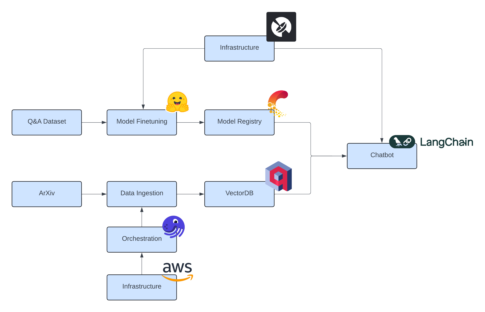

# Tech News RAG-based Chatbot

This project consists of a proof of concept application for users to quickly obtain answers to queries on AI developments, supported by sources such as papers or blogs.

# Overall System

## Data Ingestion

The main components used here are the `Qdrant` vectorDB and the `HuggingFace transformers` library. The `arXiv` API serves as the data source, although other data sources are easy to add in the future. Information for the queried papers is clenead, tokenized, and embedded using a pre-trained sentence transformer model from HuggingFace. The embeddings are uploaded into the Qdrant vectorDB, along with relevant metadata.
These components are orchestrated using `Dagster`, ensuring they run with daily frequency. The entire data pipeline is deployed on `AWS ECS`.

## Model Fine-Tuning

Main components used here are `Comet-ML`, `Pytorch`, and multiple libraries from `Hugging Face`, namely `peft`, `bitsandbytes`, `datasets`, `transformers` and `trl`. Together, these libraries are used to load and efficiently fine-tune an LLM (in this case Falcon-7B-Instruct) on a Q&A dataset. `Comet-ML` is used to log the experiments, allowing metric comparion between runs, and also storing critical artifacts such as the model file itself. These artifacts are then used by in the last (inference) pipeline.
The model fine-tuning requires a GPU to train, `Beam` is used to access the needed infrastructure.

## Chatbot

In this stage, a RAG-based chatbot application is orchestrated using `Langchain`. Based on the user's question, relevant documents are pulled from the `Qdrant` vectorDB and used to enchace the context. The fine-tuned LLM is pulled from `Comet-ML` and is used to generate the response. The application is deployed on `Beam` as an endpoint.

# Guide

The three components are relatively decoupled, only interacting through Comet-ML and Qdrant, and such they can be ran and deployed (if applicable) independently. For details on how to do this, check the READMEs of each component.

# Future Improvements

- [ ] Add automatic ECS deployment CD for the data ingestion pipeline
- [ ] Monitor/evaluate the LLM outputs (e.g [Opik](https://www.comet.com/site/products/opik/))
- [ ] Improve RAG performance
    - [ ] Add [contextual retrieval](https://www.anthropic.com/news/contextual-retrieval)
    - [ ] Add query expansion
    - [ ] Add self query
- [ ] Add more data sources
